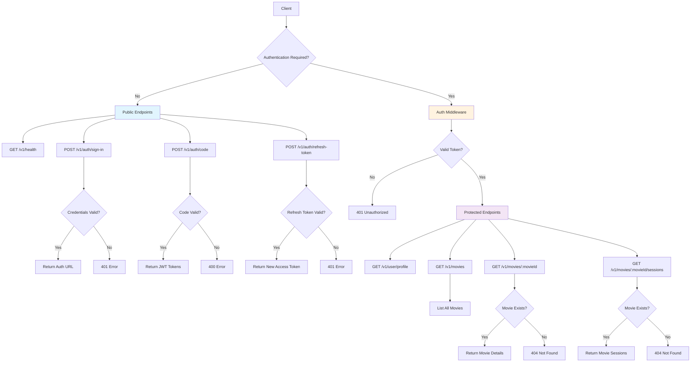

# Ingresso.GO API

A modern movie theater ticket management API built with Go and AWS services.

## 🎯 Overview

Ingresso.GO is a RESTful API designed for movie theater ticket management. It provides secure authentication, movie browsing, session management, and integrates with AWS services for a scalable cloud-native architecture.

## 🛠 Tech Stack

- **Language**: Go 1.23+
- **Web Framework**: Gin
- **Database**: PostgreSQL with pgx driver
- **Authentication**: AWS Cognito
- **Cloud Services**: AWS (SES for emails, Lambda functions)
- **Development**: Air (hot reload)
- **Containerization**: Docker & Docker Compose

## 🚀 Features

- **Authentication & Authorization**
  - AWS Cognito integration for secure user management
  - JWT token-based authentication
  - OAuth2 authorization code flow
  - Token refresh functionality

- **Movie Management**
  - Browse available movies
  - View movie details
  - List movie sessions
  - Session scheduling

- **User Management**
  - User profile management
  - Secure user registration with pre-signup triggers

- **Email Services**
  - Transactional emails using AWS SES
  - Upcoming movie session notifications
  - Empty seats alerts

## 📋 API Endpoints

### Endpoint Flow Diagram



### Public Endpoints
- `GET /v1/health` - Health check
- `POST /v1/auth/sign-in` - User authentication
- `POST /v1/auth/code` - Exchange authorization code for tokens
- `POST /v1/auth/refresh-token` - Refresh access token

### Protected Endpoints (Requires Authentication)
- `GET /v1/user/profile` - Get user profile
- `GET /v1/movies` - List all movies
- `GET /v1/movies/:movieId` - Get specific movie details
- `GET /v1/movies/:movieId/sessions` - List sessions for a movie

## 🏃‍♂️ Getting Started

### Prerequisites
- Go 1.23 or higher
- Docker and Docker Compose
- PostgreSQL (if running locally)
- AWS account with Cognito setup

### Environment Variables
Copy the example environment file and configure your variables:

```bash
cp .env.example .env
```

Required environment variables:
- `PORT` - Server port (default: 8080)
- `COGNITO_USER_POOL_ID` - AWS Cognito User Pool ID
- `COGNITO_APP_CLIENT_ID` - AWS Cognito App Client ID
- `COGNITO_APP_CLIENT_SECRET` - AWS Cognito App Client Secret
- `COGNITO_APP_POOL_DOMAIN` - AWS Cognito Domain
- `AWS_ACCESS_KEY_ID` - AWS Access Key
- `AWS_SECRET_ACCESS_KEY` - AWS Secret Key
- `AWS_REGION` - AWS Region (default: us-east-1)
- `ALLOWED_ORIGINS` - CORS allowed origins

### Development Setup

1. Install dependencies:
```bash
go mod tidy
```

2. Run with hot reload:
```bash
air
```

3. Build and run:
```bash
go build -o go-api main.go
./go-api
```

### Docker Setup

Run the entire stack with Docker:

```bash
docker compose up -d
```

This will start:
- The Go API server
- PostgreSQL database with automatic initialization

### Database Setup

The project uses PostgreSQL. When running with Docker, the database is automatically configured with the `db/init.sql` file.

For manual database setup:

```bash
psql -h localhost -U postgres -d ingresso_go -f db/init.sql
```

**Database connection details:**
- Host: localhost (or `db` within Docker network)
- Port: 5432
- User: postgres
- Password: postgres
- Database: ingresso_go

## 🏗 Project Structure

```
├── internal/
│   ├── domain/           # Business logic
│   │   ├── auth/         # Authentication handlers
│   │   ├── movies/       # Movie-related operations
│   │   └── user/         # User management
│   ├── infra/            # Infrastructure layer
│   │   ├── config/       # Configuration management
│   │   ├── middlewares/  # HTTP middlewares
│   │   ├── repositories/ # Data access layer
│   │   └── services/     # External service integrations
│   └── routes/           # HTTP route definitions
├── functions/            # AWS Lambda functions
├── db/                   # Database migrations and setup
└── main.go              # Application entry point
```

## 🔧 Development

This project follows Go best practices and clean architecture principles:

- **Domain layer**: Contains business logic and use cases
- **Infrastructure layer**: Handles external dependencies (database, AWS services)
- **Clean separation**: Clear boundaries between layers
- **Dependency injection**: Services are injected through constructors

## 📝 Contributing

1. Fork the repository
2. Create a feature branch
3. Make your changes
4. Run tests and ensure code quality
5. Submit a pull request

## 📄 License

This project is for educational purposes and practicing Go development.